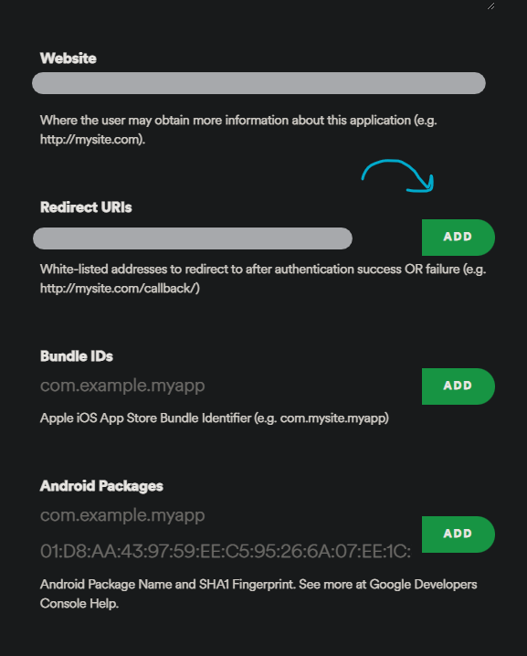
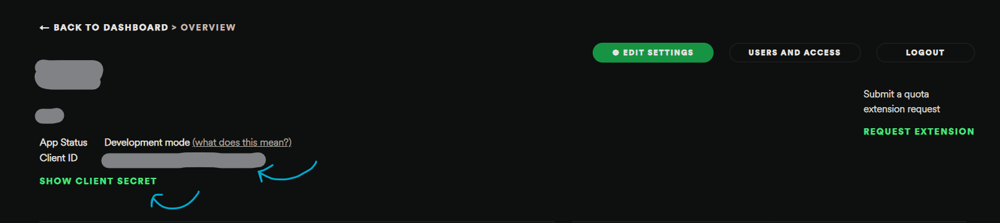

Description:
-----------------------------
This is cli tool, written in python for download songs in your spotify playlist as .mp3 files using spotipy, a spotify api wrapper for python, and yt-dlp, a youtube-dl fork for python.

Usage:
----------------------------
First you need to set environment variables like so (use SET instead of export on Windows):

export SPOTIPY_CLIENT_ID='your-spotify-client-id'  
export SPOTIPY_CLIENT_SECRET='your-spotify-client-secret'  
export SPOTIPY_REDIRECT_URI='your-app-redirect-url'

You can find your spotify client id and secret by first logging to spotify developer site: https://developer.spotify.com/dashboard/

After accept the ToS, you need to create an app, 

After you create an app you can basicly find redirect uri by clicking the 'EDIT SETTINGS' button and add your redirect uri, 

And finally you can see your client id and if you click the 'SHOW CLIENT SECRET' button you will see your client secret, 

After you get all your Client ID, Client Secret et Redirect Uri you can easily set it like 